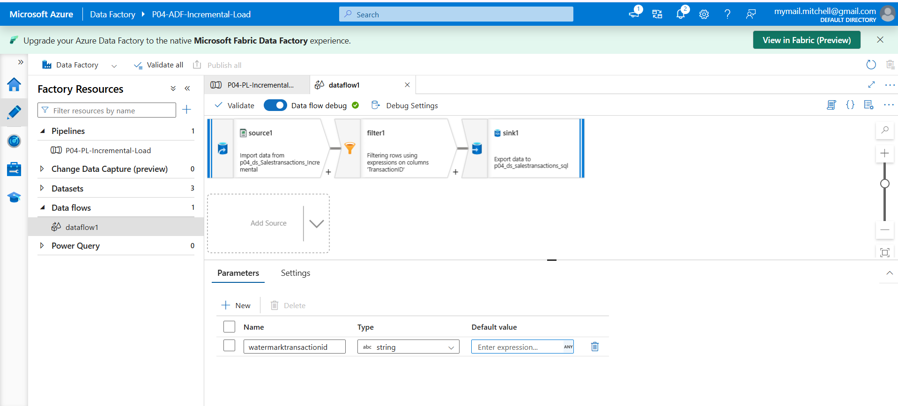
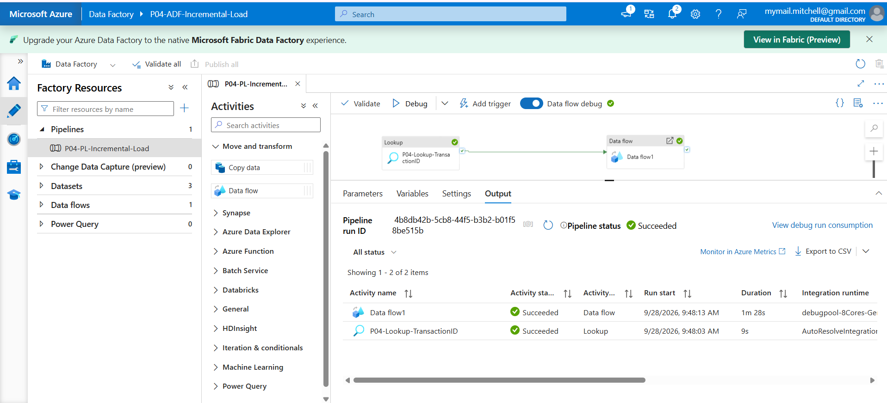

# P04 Incremental Load Pipeline using Watermark

## Pipeline uses a lookup to get max TransactionID

This pipeline uses a Lookup activity to retrieve the maximum TransactionID currently stored in the Azure SQL SalesTransactions table. This value is used as a watermark so that only new transactions are processed and loaded.

1. Lookup activity retrieves max transaction ID from Azure SQL SalesTransactions. 
2. Data flow receives that value as the watermark. 
3. Source reads transactions from the CSV file. 
4. Filter keeps only rows where transaction ID is greater than the watermark. 
5. Sink writes only the new transactions into the Azure SQL SalesTransactions table.

## WaterMark Logic

The lookup activity runs a SQL query to get the current maximum TransactionID from the destination table.

``` SQL
Select MAX(TransactionID) as MaxTransactionID from dbo.SalesTransactions.
```

This value is passed into the data flow and used by the filter transformation to identify new transactions only. Add that in and tell me when it's done.

## Filter Logic.

The filter transformation compares each TransactionID from the source file with the watermark value returned by the lookup activity. Only records with a TransactionID greater than the watermark are allowed through to the sink.

``` Text
Transaction ID greater than dollar watermark transaction ID.
```

## Mapping Data Flow

1. Source reads the sales transactions CSV file. 
2. Filter applies the watermark condition to identify new transactions. 
3. Sink loads the filtered transactions into the Azure SQL SalesTransactions table.



## Pipeline Execution.

The pipeline was successfully executed in Azure Data Factory.

1. P04-Lookup-TransactionID succeeded. 
2. Data flow 1 succeeded. 
3. Source had ten records, data flow read ten records, no duplicates were written due to the existing watermark already being TXN0110.




